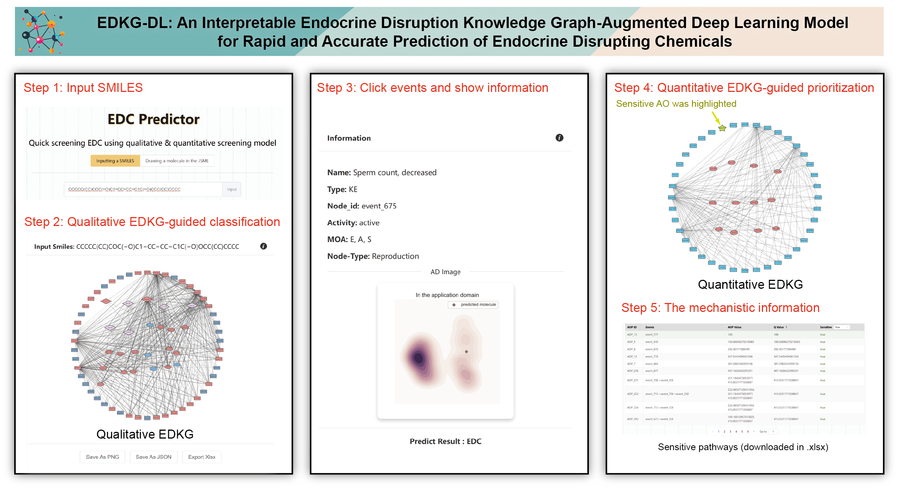

# EDKG-DL: An Interpretabile Endocrine Disruption Knowledge Graph-Augmented Deep Learning Model for Rapid and Accurate Prediction of Endocrine Disrupting Chemicals

This repository is the official implementation of **EDKG-DL**, proposed in our unpublished manuscript:  
[**Toward Sustainable Screening of Multi-Endpoint Endocrine-Disrupting Chemicals via a Causality-Integrated Knowledge Graph Deep Learning Framework**].  
The paper has been submitted and is currently under peer review.

🔑 **Keywords**: endocrine disruption, knowledge graph, deep learning, causality, toxicity prediction

# 💖 Brief introduction
We propose an **D**eep **L**earning framework with causality-integrated **E**ndocrine **D**isruption **K**nowledge **G**raph (**EDKG-DL**), designed to enable efficient, interpretable, and sustainable screening of endocrine-disrupting chemicals (EDCs).  
This repository provides the **core code and modeling data** used in our unpublished manuscript (currently under peer review). For the **complete model**, including the endocrine disruption knowledge graph, toxicology datasets, and interactive prediction platform, please visit 👉 [https://www.edkgdl.com/#/](https://www.edkgdl.com/#/).

<div align="center">
  
</div>

## 🤖 Model

1. **Graph-informed data preparation**  
   Assay outcomes from 26 in vitro and in vivo tests are mapped onto EDKG biological elements, generating two toxicity-informed graph representations:  
   - a **qualitative graph** (74 elements with binary annotations), and  
   - a **quantitative graph** (52 elements with potency values, including (Q)SAR-based predictions).  

2. **Qualitative EDKG-guided classification**  
   The qualitative graph is embedded into a three-layer edge-based **graph convolutional network (GCN)**. This module captures mechanistic interactions to predict whether a compound exhibits overall endocrine-disrupting potential, outputting a binary EDC/non-EDC label.  

3. **Quantitative EDKG-guided prioritization**  
   For compounds classified as EDCs, the quantitative graph is used to estimate **adverse outcome (AO)-specific potency** and predict **NOAEL** values. By tracing upstream causal pathways, this module identifies the most sensitive AO and its mechanistic drivers, supporting evidence-based prioritization and risk assessment.  

<div align="center">
  
</div>


# 🔬 Requirements

All experiments were run in **Jupyter Notebook** environment.

To run our code, please install dependency packages.
```
python          3.12.0
torch           2.8.0+cu126
torch-geometric 2.6.1
numpy           2.3.1
pandas          2.3.0
scikit-learn    1.6.1
torchvision     0.23.0+cu126
wandb           0.20.1
xgboost         3.0.2
```

# 📚 Overview

This project mainly contains the following parts.

```
├── Graph-informed data preparation                  # Data, models, and notebooks for constructing qualitative and quantitative graphs
│   ├── edkgdl_data_pipeline.ipynb                   # Jupyter notebook for data preprocessing
│   ├── edkgdl_element_classifier.ipynb              # Jupyter notebook for building node classification models
│   ├── edkgdl_element_classifier.ipynb              # Jupyter notebook for building node regression models
│   │
│   ├── qualitative_models/                           # Qualitative graph construction
│   │   ├── model.pkl                                # Trained qualitative classification model (74 nodes)
│   │   └── data.csv                                 # Modeling data for qualitative graph construction
│   │
│   └── quantitative_models/                          # Quantitative graph construction
│       ├── model.pkl                                # Trained quantitative regression model (52 nodes)
│       └── data.csv                                 # Modeling data for quantitative graph construction
│
└── Qualitative EDKG-guided classification           # EDKG-based qualitative EDC prediction with GCN
    ├── train.ipynb                                  # Notebook to train the GCN on EDKG for EDC prediction
    ├── predict.ipynb                                # Notebook to run inference for EDC determination with the trained model
    ├── model_state.pt                               # Saved model weights for the trained predictor
    └── edkgdl_all_data/                             # All datasets used for model training, validation, and testing
        ├── 0/                                       # Compound 0
        │   ├── Graph_index.txt                      # Node list with activation labels
        │   └── Graph_edge_index_direct.txt          # Directed edges with attributes and confidence
        ├── 1/                                       # Compound 1
        │   ├── Graph_index.txt
        │   └── Graph_edge_index_direct.txt
        ├── 2/
        │   ├── Graph_index.txt
        │   └── Graph_edge_index_direct.txt
        └── ...                                      # One folder per compound (0, 1, 2, ...)
```

### 📑 Data schema (per compound folder)

Each compound folder (e.g., `0/`) contains two files describing its EDKG subset:

---

#### `Graph_index.txt`  
Two columns (whitespace or tab-delimited):

1. **node_id** *(int)*: node index in the EDKG  
2. **activated** *(int)*: node activation label  
   - `1` = activated  
   - `0` = not activated  

**Example**  
```
0 1
1 0
2 1
```
#### `Graph_edge_index_direct.txt`  

Four columns (whitespace or tab-delimited):

1. **src** *(int)*: source node id  
2. **dst** *(int)*: target node id  
3. **edge_attr** *(float)*: edge activation attribute  
   - both nodes activated → `1`  
   - exactly one node activated → `0.5`  
   - neither node activated → `0`  
4. **confidence** *(float)*: confidence score (larger = higher confidence)  

**Example**  
```
49 21 0 3
17 49 0 5
17 37 0 5
```


# 📝 Note
All training data were generated by first converting **SMILES strings** into **molecular descriptors/fingerprints**.  
The conversion was performed using **PaDEL-Descriptor**, which can be downloaded from:  
[http://yapcwsoft.com/dd/padeldescriptor/](http://yapcwsoft.com/dd/padeldescriptor/)

# About
Should you have any questions, please feel free to contact **Dr. Haoyue Tan**   at njutanhaoyue@nju.edu.cn.
